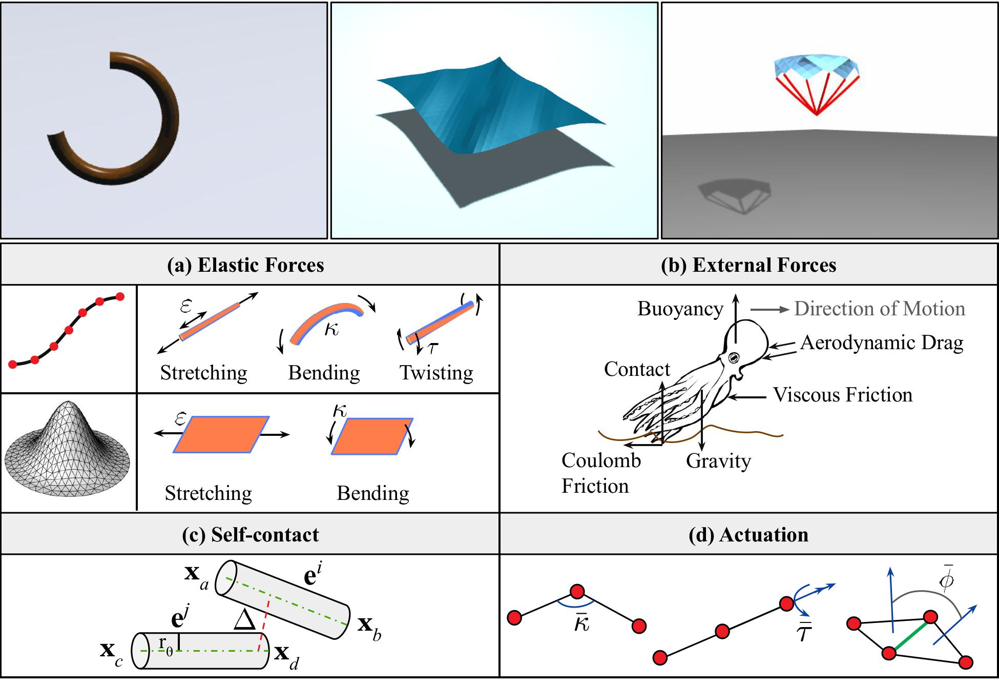
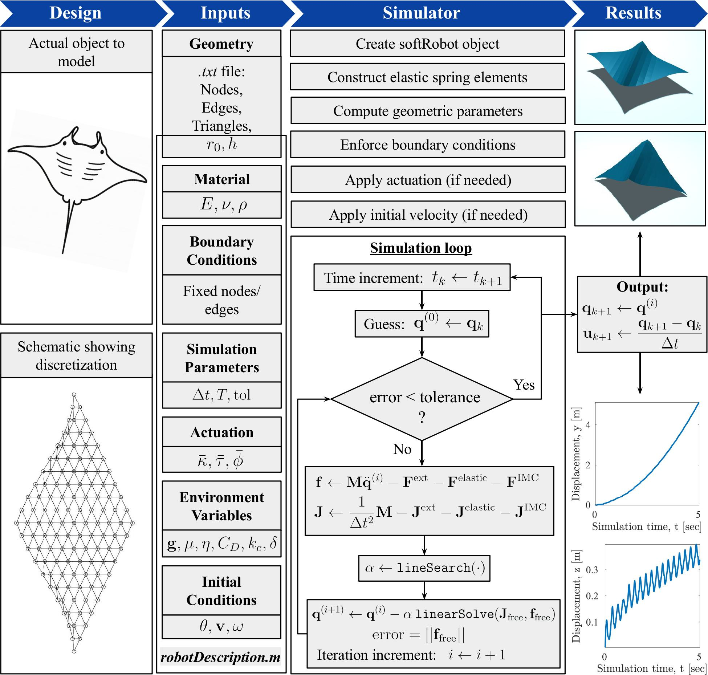
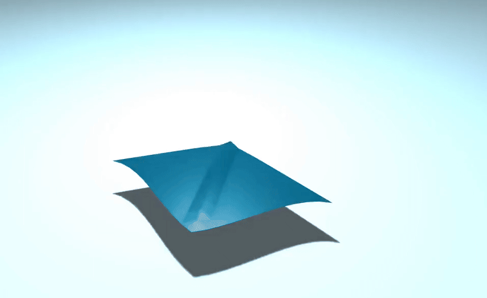
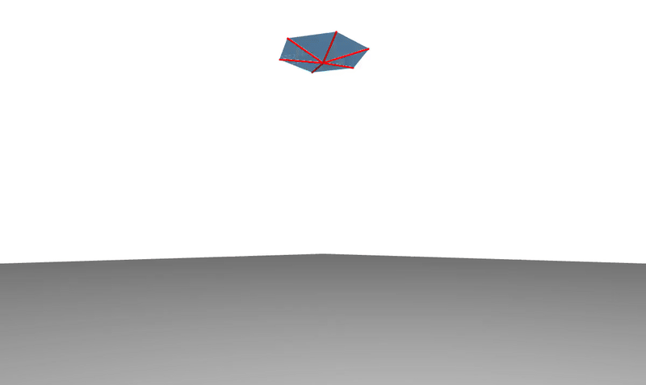
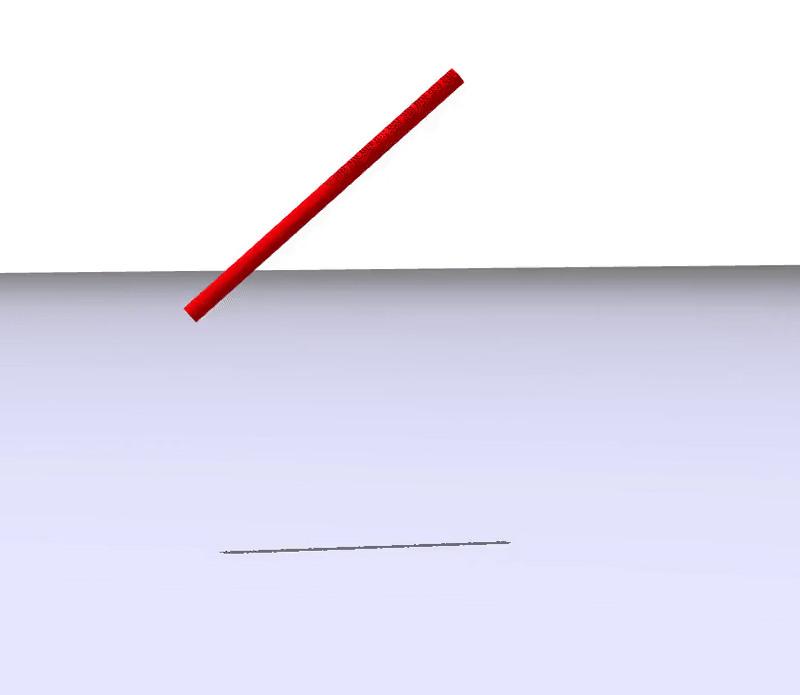
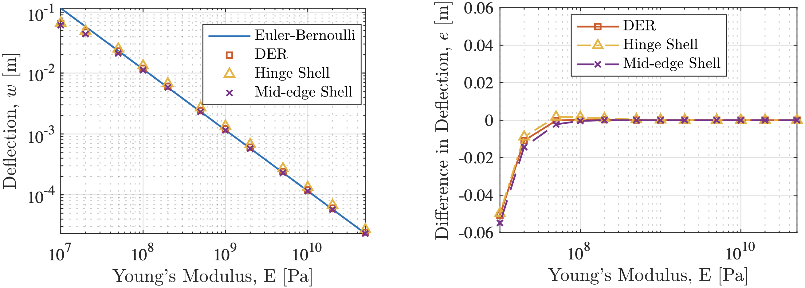

# MAT-DiSMech: Discrete Differential Geometry-based Simulator for Rods, Shells, and Soft Robots

MAT-DiSMech is a MATLAB-based simulation framework for modeling the dynamics of soft robotic systems composed of rods, shells, or their combinations. Built upon the principles of Discrete Differential Geometry (DDG), the simulator offers a balance between physical accuracy and computational efficiency. It supports modeling complex deformations including stretching, bending, twisting, and contact, and is designed to be accessible, extensible, and educational. Please refer to our [manuscript](https://doi.org/10.48550/arXiv.2504.17186) for details on the theory.

## Introduction

Soft robots rely on flexible structures for motion and interaction, often undergoing large, nonlinear deformations. Simulating such systems poses challenges in achieving both fidelity and computational tractability. MAT-DiSMech addresses these through a DDG-based approach, discretizing the system into elastic elements and solving its nonlinear dynamics using implicit time integration. It is ideal for researchers and students seeking a fast, accurate, and open-source tool for simulating slender soft robotic structures in MATLAB.

## Features

- **Unified framework for rods, shells, and hybrid structures**
- **Implicit time integration** for enhanced stability in contact-rich scenarios
- **Support for geometric nonlinearities**, including bending, twisting, and large deformations
- **Elastic energy-based formulation using DDG** including:
  - Discrete elastic rods (stretching, bending, twisting)
  - Hinge-based and mid-edge normal-based shell bending models
- **Implicit contact model (IMC)** for self-contact and friction
- **Environmental forces:** gravity, buoyancy, ground contact, Coulomb & viscous friction, and aerodynamic drag
- **Time-dependent actuation support** via curvature or twist modulation
- **Modular and accessible MATLAB implementation** with no external dependencies

 

### TO-DO:
- [ ] Add shell self-contact and friction.
- [ ] Vectorized treatment of springs in computing elastic forces for enhanced efficiency.
- [ ] Python version - Coming Soon!
- [ ] Add shell functionality in [C++ version](https://github.com/StructuresComp/dismech-rods.git)

If you'd like MAT-DiSMech to support a new feature, feel free create an issue, and we'll add it to
the list here.
For those looking to contribute, PRs are always welcome!

## Instructions to Simulate a Soft Robot

### 1. Clone the Repository

```bash
git clone https://github.com/StructuresComp/dismech-matlab.git
cd dismech-matlab
```

### 2. Prepare Inputs

To simulate a soft robot, provide the following input:

- **`inputGeometry.txt` file:** containing node positions, edge list (for rods), and triangle list (for shells) for the discretized soft-robot structure.
- **`robotDescription.m` file:** containing Material properties, Simulation parameters, Boundary conditions, Initial conditions on velocity (if any), Actuation (if any), Environmental properties.

The [`./experiments`](./experiments) folder contains examples of both files. Each subfolder contains the input files to reproduce the different simulation examples described below.

### 3. Run a Simulation

Edit or use an existing script (e.g., `main.m`) and execute it in MATLAB. The simulation will step through time using implicit Euler integration and visualize results in real time.


 

## Simulation Examples

The repository includes scripts and input files to reproduce the following simulations (and more):

### Manta Ray Swimming
Flapping and undulatory motion are modeled using sinusoidal hinge actuation with aerodynamic drag, buoyancy, and gravity forces.



### Parachute
Demonstrates handling of the dynamics of a hybrid structure made out of a shell canopy and rod tethers under aerodynamic drag and gravity.



### Rod-Ground Collision
Evaluates elastic and frictional contact. Demonstrates soft vs. stiff material response upon ground impact.
|  |  |
|:----------------------:|:----------------------:|
| Rod with E = 2 MPa       | Rod with E = 2 GPa     |


## Validation with Cantilever Beam
Static deflection under gravity from different models in our simulator compared against analytical solutions using Euler-Bernoulli beam theory.
 

## Citation

If our work has helped your research, please cite the following paper.
```
@misc{lahoti2025matdismech,
      title={{MAT-DiSMech: A Discrete Differential Geometry-based Computational Tool for Simulation of Rods, Shells, and Soft Robots}}, 
      author={Radha Lahoti and M. Khalid Jawed},
      year={2025},
      eprint={2504.17186},
      archivePrefix={arXiv},
      primaryClass={cs.RO},
      url={https://arxiv.org/abs/2504.17186}, 
}
```

## Acknowledgments

This code framework is developed at the Structures-Computer Interaction Lab, UCLA. The work is supported by the National Science Foundation and the National Institute of Neurological Disorders and Stroke. Any opinions, findings, and conclusions or recommendations expressed in this material are those of the author(s) and do not necessarily reflect the views of the National Science Foundation or the National Institute of Neurological Disorders and Stroke.

